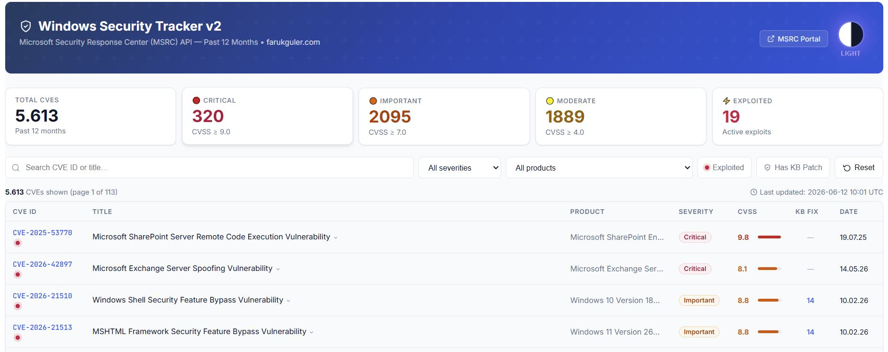

# Microsoft Security Tracker (MSRC) v2

A live CVE tracking dashboard powered by the **Microsoft Security Response Center (MSRC) API**, built as a standalone HTML page with automated daily updates via GitHub Actions.

  



---

## What It Does

- Fetches all CVE vulnerabilities from MSRC for the **past 12 months** — automatically, every hour.
- Displays severity levels (Critical / Important / Moderate / Low), CVSS scores, and exploit status.
- Shows **which KB article patches each vulnerability**, with direct links to the Microsoft Update Catalog.
- Fully searchable and filterable — by severity, product, exploit status, or KB availability.

## Live Features

| Feature | Details |
| --- | --- |
| **Light / Dark theme** | Click the toggle button to switch themes; preference is saved |
| **Click a row** | Expands KB patch panel — shows KB numbers, fixed builds, affected products |
| **"Has KB Patch" filter** | Instantly narrows to only patched CVEs |
| **KB search** | Type `KB5094125` in the search box to find which CVE it fixes |
| **Sorting** | Click any column header to sort |
| **Pagination** | 50 CVEs per page |

---

## Project Structure

```text
.github/
  workflows/
    fetch-msrc.yml      # GitHub Actions: fetches + parses MSRC API hourly
data/
  msrc_cves.json        # Parsed CVE data (auto-generated, do not edit)
index.html              # The standalone dashboard page
README.md               # Project documentation
winsecurity.py          # Data collection script (used by both CI and local testing)
```

---

## Local Testing

If you want to run the data collection script locally on your machine:

1. Ensure you have Python installed.
2. Run the script:

```bash
python winsecurity.py
```

This will fetch the rolling 12 months of MSRC CVE data and update `data/msrc_cves.json` locally.

---

## Setup & Deployment (GitHub Pages)

### 1. Push files to your repository

Create a new GitHub repository (e.g., `github.com/faruk-guler/winsecurity`) and push the following files/directories:

- `.github/workflows/fetch-msrc.yml`
- `data/msrc_cves.json` (initial seed data)
- `index.html`
- `README.md`

### 2. Enable GitHub Actions write permissions

Go to your repo → **Settings → Actions → General → Workflow permissions**
→ Select **"Read and write permissions"** and check **"Allow GitHub Actions to create and approve pull requests"** → Save.

### 3. Enable GitHub Actions

Go to the **Actions** tab of your repository, select **Fetch MSRC CVE Data**, and click **Run workflow** to trigger the first fetch manually.

### 4. Enable GitHub Pages

Go to your repo → **Settings → Pages**
→ Under **Build and deployment**, set **Source** to **Deploy from a branch**
→ Choose your branch (e.g., `main` or `master`) and folder (`/ (root)`) → Save.

Your dashboard will be live at:

```text
https://faruk-guler.github.io/winsecurity/
```

---

## Auto-Update Schedule

The GitHub Actions workflow runs **every hour**.
Each month it automatically picks up the new Patch Tuesday release from Microsoft and consolidates it with the previous 11 months of data.

---

## Tech Stack

- **Data source**: [MSRC CVRF API v3.0](https://api.msrc.microsoft.com/cvrf/v3.0/)
- **Automation**: GitHub Actions
- **Frontend**: Vanilla HTML/CSS/JS (no frameworks)
- **Hosting**: GitHub Pages (static site hosting)

---

## Author

Faruk GULER / Sysadmin
